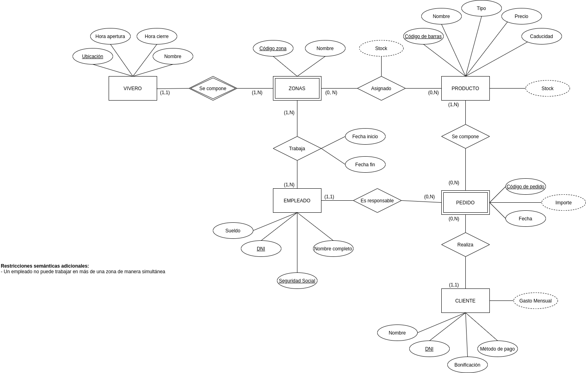
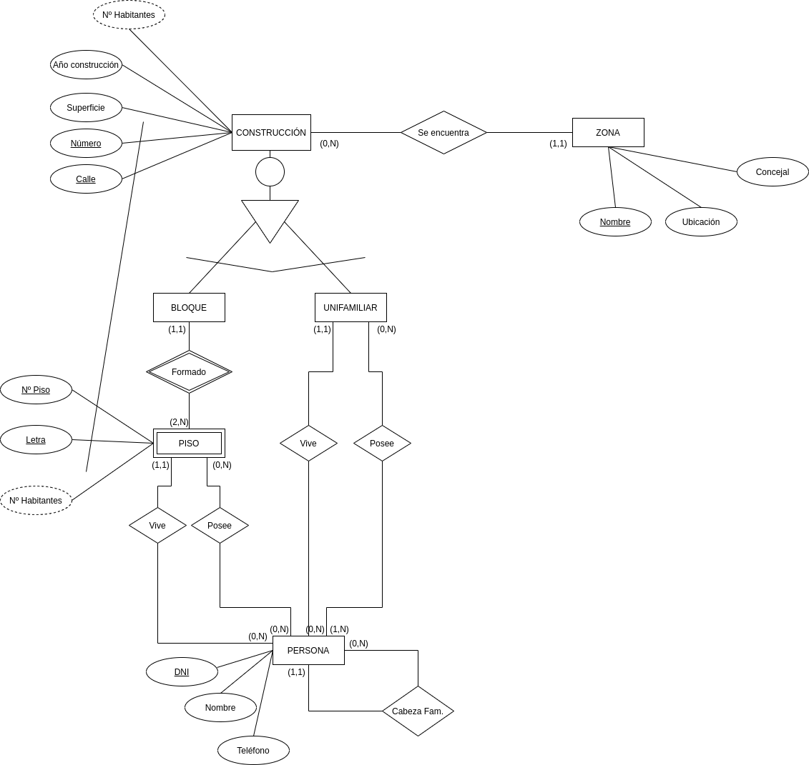
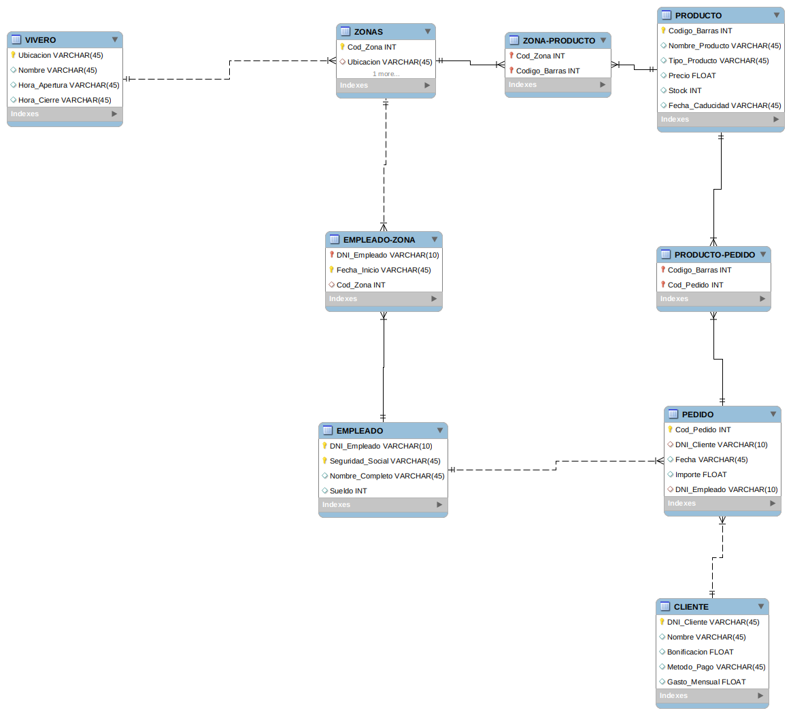
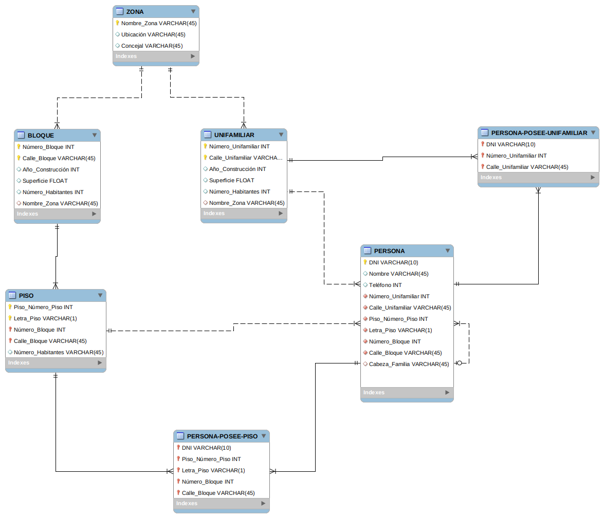

# Práctica 4
## Administración y Diseño de Bases de Datos
### David Valverde Gómez
## Modelos Entidad - Relación
### Viveros

### Catastros

## Modelos Lógicos Relacionales
### Viveros

### Catastros

## NOTA
Por diversos errores con los scripts generados que no he sido capaz de solucionar, no he podido crear las tablas en SQL. Esta semana pediré tutorías para intentar solucionar este error.