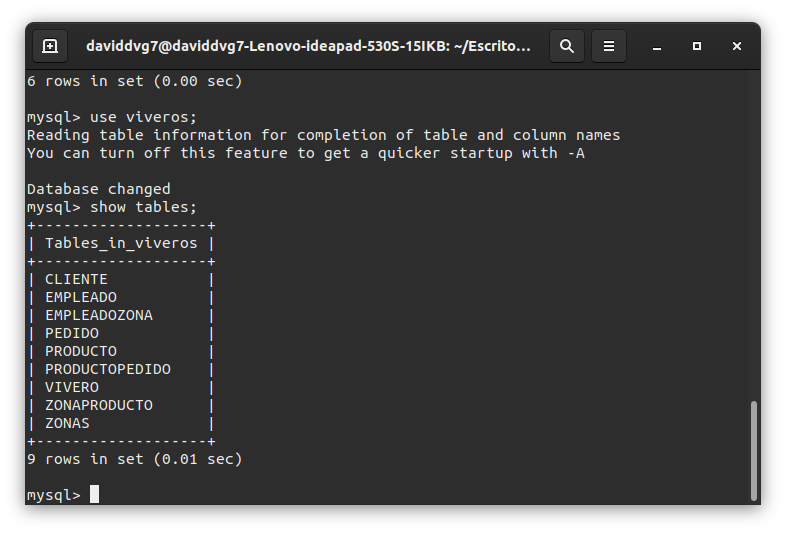
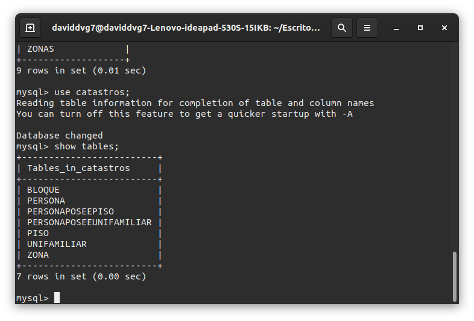
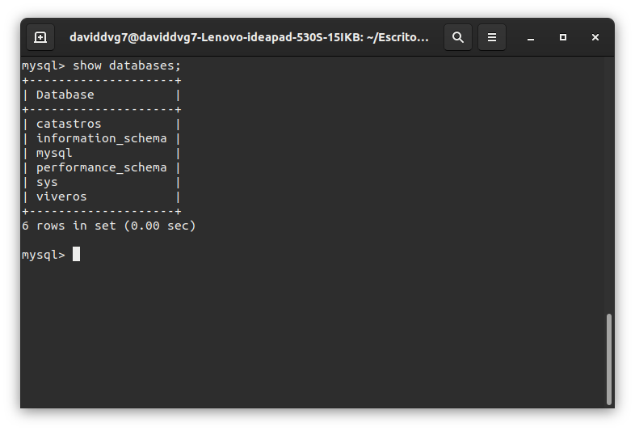

# Práctica 4
## Administración y Diseño de Bases de Datos
### David Valverde Gómez
## Modelos Entidad - Relación
### Viveros

### Catastros

## Modelos Lógicos Relacionales
### Viveros

### Catastros

